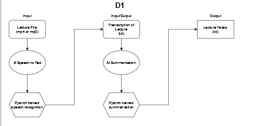

# Design Diagrams

### D0:

- Inputs: a pre-transcribed lecture
- Output: A note sheet summarizing lecture content

### D1:

- The Speech to Text AI generates a transcription of the lecture using pytorch
- Using the lecture transcription, a summarized notes sheet is generated. 

### D2:

- Handle audio input using torchaudio libary.
- Train the pytorch AI using the lecture content and generate a lecture transcription.
- Another AI is trained to generate a notes sheet from the lecture summary to return to the user. 

